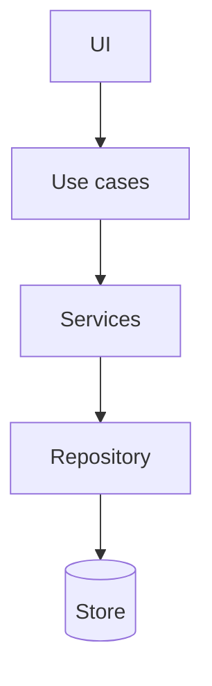
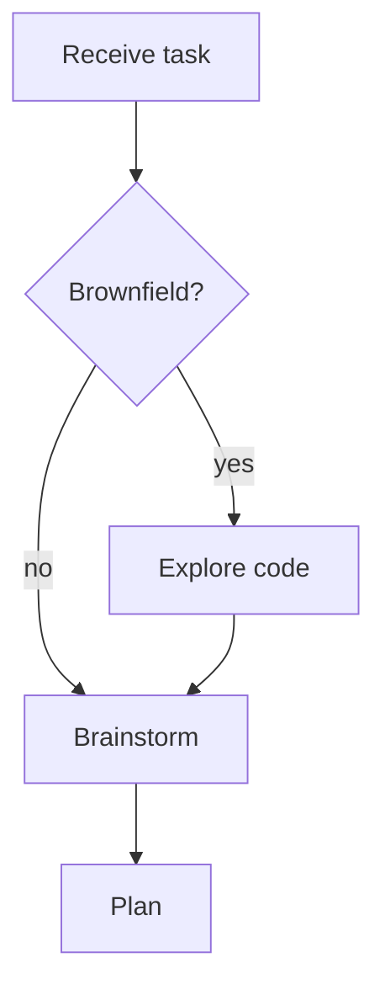
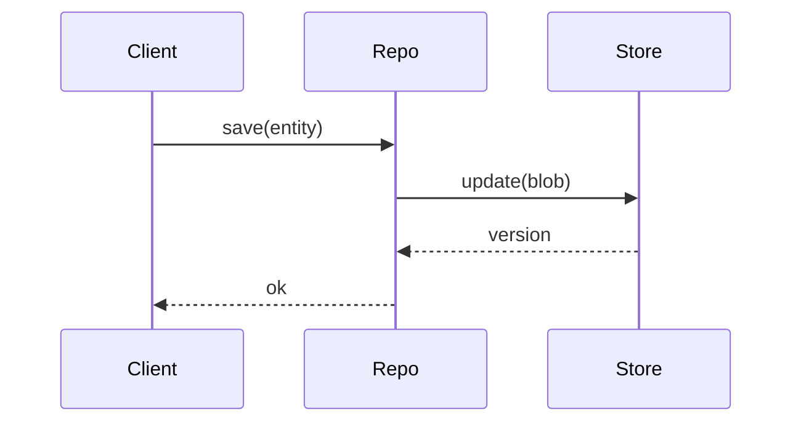

# gen-uml

## Overview

Generate a **Mermaid** diagram from existing code — architecture, flow, or sequence — and
verify it reflects what the code actually does, not what it was supposed to do.

## Steps

1. **Read the real code** for the slice you're diagramming (entry points, modules,
   call/data flow). Diagram what exists.
2. **Pick the diagram type** that answers the question being asked (below).
3. **Emit Mermaid.**
4. **Match-check (required):** walk the diagram against the code one node/edge at a time.
   Every box maps to a real module/function; every arrow to a real call/dependency. Drop or
   fix anything you can't point to in the source. A diagram that quietly diverges is worse
   than none.

## Types & examples

**Architecture** (modules/dependencies):

**Flow** (a process / decision path):

**Sequence** (interaction over time):

## Output

The Mermaid block plus one line per diagram confirming the match-check passed (or listing
what was corrected).
